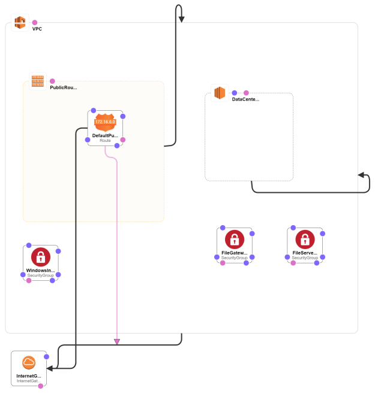

# Data Engineering: Storing Big Data Predict 

## Part-1: Establishing an On-Premise Source Connection 

<p align="center">
  
    <br>
    <em>An illustration of the system you'll provision and configure during the first task.</em>
</p>

It's time for your boss's first challenge! 

She pulls out the above figure to help explain what she expects. Recently the team completed an on-premise to cloud data migration for a large organisation. Critical to this project was the creation of a source connection from the organisation's file server to a cloud-based object store via a file gateway. Seeing that this step was so integral, your boss asks you to recreate this scenario using a collection of cloud technologies. 

Given your experience in configuring cloud based services, the task sounds simple. However, as an additional curve ball, your boss wants to assess your ability to learn new technologies while on a project. As such, she specifies that *you are only allowed to setup your initial computing environment by using the AWS* [*CloudFormation*](https://aws.amazon.com/cloudformation/) *service*, along with the *YAML version* of its template language. This makes things a lot trickier... 


Luckily for you, in order to not be a tyrant, your boss promises that you will receive some help and guidance for this part of the task, as well as a full specification of the parameters for the technologies you'll be expected to utilise. Her guidance follows below:       

### Step 1: Establishing Prerequisites  

Before you do anything, your boss advises you that there are some prerequisite configuration processes that you'll need to follow in order to complete this task:

1. **Ensure you have access to an AWS account and IAM role with Admin privileges**: You'll be required to configure a large number of resources and settings as part of creating the on-premise source connection. As such, having admin privileges associated with your IAM user is vital. 

2. **Select the correct AWS region**: Your boss expects all work to be completed within the `eu-west-1` AWS region. Ensure that this region is used where applicable throughout the following steps of the task. 

3. **Conform to an appropriate naming convention**: Wanting to monitor your work as you progress through this part of the challenge, your boss asks you to use the following convention to name each service you configure: **"DE{first 3 letters of your name capitalised}{first 3 letters of your surname capitalised}-{name of service}"**. For example, when configuring a VPC, and having the name *"Dora Explorer"*, the applied service name would be *"DEDOREXP-VPC"*.   

4. **Generate a new key pair to access resources created within this part of the challenge**: To securely log into the resources you create during the task (ensuring that no one from your team tampers with your efforts), create a new key pair under the AWS EC2 service. 
    - Set the name of key pair using the challenge naming convention, e.g. *"DEDOREXP-keypair"*. 
    - Following this process should produced a `.pem` file for download. Store this file in a secure location for use later on in the task.     


|    🚩 **Student Instructions** 🚩    |
| ------------------------------------ |
| Ensure that you follow and complete actions 1-4 above. Failing to do so will prevent you from completing this section of the Extract Predict. | 

### Step 2: Provisioning Infrastructure

With all the prerequisite setup actions completed, you're now ready to start building-out your environment. This is where your boss asks you to put your learning cap on. Instead of getting you to manually configure the multiple resources required for this part of the task, she rather wants you to learn about AWS [CloudFormation](https://aws.amazon.com/cloudformation/) - a service that allows you to manage [infrastructure as code](https://datafloq.com/read/infrastructure-code-benefits-tools/11355). 

Your boss explains that becoming familiar with CloudFormation will require an understanding of both the YAML language, as well as CloudFormation's template specific syntax. While this may seem daunting, she assures you that mastering the concepts is easier than it seems. Besides, according to her, some sleepless nights are always the hallmark of a true data engineer...  

|    🚩 **Student Instructions** 🚩    |
| ------------------------------------ |
| Within this step you will provision the base infrastructure for part-1 of the Extract Predict. As instructed, this will be done using YAML templates written for and launched via AWS CloudFormation. Information in the following subsections will help you complete this task.| 

#### 2.1) Resource Links

So what is YAML and how can it be used alongside CloudFormation templates in order to generate infrastructure as code? To help you find answers to these questions, your boss provides the following resources to start you on your learning journey: 

**YAML**

 - [Getting Started with YAML](https://www.cloudbees.com/blog/yaml-tutorial-everything-you-need-get-started/)
 - [Using YAML for CloudFormation](https://markrichman.com/yaml-for-aws-cloudformation/)

**CloudFormation Templates**

 - [CloudFormation Concepts](https://docs.aws.amazon.com/AWSCloudFormation/latest/UserGuide/cfn-whatis-concepts.html)
 - [A Beginner's Guide to CloudFormation Templates](https://docs.aws.amazon.com/AWSCloudFormation/latest/UserGuide/gettingstarted.templatebasics.html)
 - [CloudFormation Template Anatomy](https://docs.aws.amazon.com/AWSCloudFormation/latest/UserGuide/template-anatomy.html)
 - [Resource Dependence in CloudFormation Resource Creation](https://docs.aws.amazon.com/AWSCloudFormation/latest/UserGuide/aws-attribute-dependson.html)
 - [Validate a CloudFormation Template via the AWS CLI](https://docs.aws.amazon.com/AWSCloudFormation/latest/UserGuide/using-cfn-validate-template.html)

|    🚩 **Student Instructions** 🚩    |
| ------------------------------------ |
| Use the above list of instructional resources to begin your learning journey surrounding CloudFormation and its support of YAML configuration templates. You will use this knowledge to both understand and create templates in the subsections below. | 

#### 2.2) Example YAML Template - The On-Premise File Server

After you've spent some time learning about YAML and CloudFormation, your boss decides it's time to give you a nudge in the right direction and shares the following YAML file with you: [Linux-instance-template](code/part1/student_linux_template.yml). 

She explains that this template will be part of the configuration files you'll use to recreate the on-premise source connection scenario, and is responsible for setting up the following infrastructure via AWS CloudFormation: 

**Resources Created**
 - *Linux Instance*: A `t2.micro` EC2 instance, used to simulate the file server used within the on-premise source connection scenario.   
 - *IAM Role*: An IAM role allowing an associated instance to access other AWS services. 
 - *S3 Access Policy*: An IAM policy giving read-only access to any bucket within the S3 service. 
 - *Instance Profile*: An IAM profile, connecting the instance and IAM role together. 

**Template Inputs**
 - *VPC*: A VPC Id that defines which VPC the Linux instance will be deployed into.
 - *Subnet*: A Subnet Id defining which subnet to associate with the deployed Linux instance.  
 - *Security Group*: A list of security group Id's which can be associated with the deployed instance.
 - *KeyName*: The name of a previously created AWS key pair which is associated with the Linux instance. 
 - *Linux AMI*: The Amazon Machine Image (AMI) which is used to configure the EC2 instance. This input specifies the latest version of Amazon's Linux as the AMI to use. 


|    🚩 **Student Instructions** 🚩    |
| ------------------------------------ |
|  Study the provided YAML template used in the creation of the Linux instance and its attending services. From your learning around YAML and CloudFormation, you should aim to understand the purpose of each field and its attending properties. This template will be used in Step 2.4 in conjunction with the CloudFormation service to launch the remote file server as part of the scenario infrastructure. | 

#### 2.3) Creating Additional Templates

Having provided the Linux template fully implemented for you, your boss describes a catch - due to the dependencies laid out in the file, you'll first need to generate a *"VPC"* base template which sets up the requisite network infrastructure into which the above resources can be deployed. What's more, you'll also need to write a second *"Windows-instance"* template which sets up the on-premise machine which can be used to access the file server declared in the above subsection. 

Not wanting you to spend forever figuring this out, your boss reassures you with a full list of the resources and inputs that need to be included in each of the respective templates: 

**VPC Template**

 - *Template Inputs*: The following items represent fields which should be entered by a user when spinning up the CloudFormation VPC template as a stack. 
   - `EnvironmentName`: A string that will be prefixed onto each resource created in the template. This will be used to help identify the resources you create during the challenge. 
     - The default value for this input value should be `DE-Extract`. 
   - `VpcCIDR`: The IPv4 address space, given in [CIDR](https://www.digitalocean.com/community/tutorials/understanding-ip-addresses-subnets-and-cidr-notation-for-networking) notation, for the VPC hosting the scenario challenge.
     - The default value for this input value should be `192.168.0.0/16`
   - `DataCenterPublicSubnetCIDR`: The IPv4 address space, again given in CIDR notation, for the publicly accessible portion of the VPC.
     - The default value for this input value should be `192.168.10.0/24`


 - *Template Resources*: The following items represent resources and their respective properties that should be configured and deployed within the VPC template.
   - `VPC`: An AWS virtual private cloud (VPC). 
     - The VPC should inherit its `CidrBlock` address from the `VpcCIDR` template input. 
     - The VPC should have both DNS support, and DNS host names enabled. 
     - The VPC should be given a {key: value} tag of {"Name": `EnvironmentName`}, where `EnvironmentName` is part of the template input given above.
   - `InternetGateway`: An internet gateway, used to provide connectivity between the VPC and the internet.
     - The internet gateway should be given a {key: value} tag of {"Name": `EnvironmentName`}, where `EnvironmentName` is part of the template input given above.
   - `InternetGatewayAttachment`: An attachment that connects the above VPC and Internet Gateway.
     - The gateway attachment should reference both the `InternetGateway` and `VPC` above for its operation.
   - `DataCenterPublicSubnet`: Declares the public subnet of the VPC (portion of the VPC which can be accessed from the internet). This represents the portion of the data center network which you can log into as part of the challenge scenario. 
     - The subnet should inherit its `VpcId` from the `VPC` created above. 
     - The first `AvailabilityZone` should be chosen for the subnet placement. *Note:* This assignment should be dynamic based upon which AWS region is chosen for the stack deployment.  
     - The subnet's `CidrBlock` configuration should be inherited from the `DataCenterPublicSubnetCIDR` template input.
     - The subnet should automatically provide any new instances deployed within it a public IPv4 address. 
     - The subnet should be given a {key: value} tag of {"Name": "DE-Extract Data Center Subnet"}.
   - `PublicRouteTable`: A route table for the configured VPC. 
     - The route table should have its `VpcId` associated with the configured `VPC` above. 
     - The route table should be given a {key: value} tag of {"Name": "DE-Extract Public Routes"}.
   - `DefaultPublicRoute`: Specifies a route in the above route table. 
     - *NB*: This resource should only be created *after* the `InternetGatewayAttachment` above!
     - The route should inherit its `RouteTableId` from the above `PublicRouteTable`. 
     - All destinations should be permitted as part of the route's `DestinationCidrBlock`. 
     - It should inherit its `GatewayId` from the `InternetGateway` resource. 
   - `DataCenterPublicSubnetRouteTableAssociation`: This resource associates the formed subnet with the route table configured above. 
     - The route table association should be assigned the `RouteTableId` of the `PublicRouteTable` created in the script. 
     - Its `SubnetId` should be that of the public subnet of the VPC (`DataCenterPublicSubnet`).
   - `WindowsInstanceSG`: The first of three security groups. This group permits [RDP](https://www.cisecurity.org/white-papers/security-primer-remote-desktop-protocol/) access to an instance deployed within the public subnet of the VPC. 
     - The security group should have a `VpcId` associating it with the `VPC` created in this template. 
     - It should be given a `GroupName` corresponding to `DE-Extract-WindowsInstanceSG`.
     - It should have an appropriately descriptive `GroupDescription`.
     - Regarding the group's `SecurityGroupIngress`, it should permit all *tcp* traffic *to and from the default RDP port (3389)*, regardless of the source IPv4 address (corresponds to a `CidrIp` of `0.0.0.0/0`).
     - The security group should be given a {key: value} tag of {"Name": "DE-Extract-WindowsInstanceSG"}.
   - `FileServerSG`: The second security group, which is responsible for permitting `ssh` access to the data center's file server from an internal source within the VPC.
     - Like the previous one, the file server security group should use its `VpcId` to associate with the `VPC` created in the template. 
     - Its `GroupName` should be `DE-Extract-FileServerSG`. 
     - As before, the security group should have an appropriately descriptive `GroupDescription`.
     - For this group's `SecurityGroupIngress`, it should permit all *tcp* traffic *to and from the default ssh port (22)*. Unlike the previous security group, however, it should *block* any traffic from addresses outside of the public subnet of the VPC (corresponds to a `CidrIp` of `192.168.10.0/24`). 
     - The security group should be given a {key: value} tag of {"Name": "DE-Extract-FileServerSG"}.
   - `FileGatewaySG`: The last of the security groups, and the last resource of the template. This security group controls the access to the file gateway instance configured later on in this challenge.
     - As all the other security groups, the file gateway security group should use its `VpcId` to associate with the `VPC` created in the template.
     - It should have a `GroupName` of `DE-Extract-FileGatewaySG`. 
     - It should also have an appropriately descriptive `GroupDescription`.
     - `SecurityGroupIngress` for the file gateway should permit tcp access *to and from all ports* on a given instance (ports 1 - 65534). However, only IPv4 addresses within the `VPC` should be able to communicate through the security group (corresponds to a `CidrIp` of `192.168.0.0/16`)   
     - Finally, the security group should be given a {key: value} tag of {"Name": "DE-Extract-FileGatewaySG"} 
 
**Windows-instance Template**

  - *Template Inputs*: The following items represent fields which should be entered by a user when spinning up the CloudFormation Windows instance template as a stack.
    - `KeyName`: A dropdown list enabling the selection of the key pair `KeyName` previously created in Step 1. This key pair is used to decrypt the Windows instance password generated on its instantiation.
    - `VPC`: A dropdown list enabling the selection of the `Id` for the VPC created in the previous template. 
    - `Subnet`: A dropdown list enabling the selection of the `Id` for the public subnet created in the previous template.
    - `SecurityGroupIds`: A multi-selection list enabling the selection of one or more security groups created in the previous template.
    - `LatestWindowsAmiId`: A string-based resource path representing the latest Windows Amazon Machine Image (AMI) that should be used to create the remove instance. 
      - *NB*: The `Type` of this input should be set to `AWS::SSM::Parameter::Value<AWS::EC2::Image::Id>`. This enables CloudFormation to select the latest version of the AMI specified within this input. 
      - *NB*: The `default` value of this input should be set to `/aws/service/ami-windows-latest/Windows_Server-2019-English-Full-Base`. During the template's deployment, this value should be used and left unchanged. 


  - *Template Resources*: The following items represent resources and their respective properties that should be configured and deployed within the Windows instance template.
    - `WindowsInstanceRole`: This is an IAM role that will be assigned to the Windows-based EC2 instance, allowing it to interact with other AWS services.
      - When the Windows instance stack is deleted, the role should be configured to *automatically delete itself* as well. (Hint: look into the [`DeletionPolicy`](https://docs.aws.amazon.com/AWSCloudFormation/latest/UserGuide/aws-attribute-deletionpolicy.html) attribute to define this behavior).
      - For the `AssumeRolePolicyDocument` trust policy, which defines the AWS entities that can assume the role, use the following configuration:
        - In the policy `Statement`, the `Action` should be `sts:AssumeRole`, and this should be *allowed* for the `ec2.amazonaws.com` *service*.  
        - The version of the trust policy should be set to `2012-10-17`
    - `WindowsInstanceProfile`: This is an IAM instance profile that allows our `WindowsInstanceRole` created above to be associated with an EC2 instance. 
      - The `Path` of the instance profile should be set to `/`. 
      - The profile `Role` should be associated with the `WindowsInstanceRole`.
    - `WindowsInstanceRolePolicy`: The IAM policy to be associated with the above-defined IAM role. This policy enables read-only access to all S3 buckets within your account. 
      - When the Windows instance stack is deleted, the policy should be configured to *automatically delete itself* as well.
      - The `PolicyName` should be dynamically configured to be "Windows-client-{StackName}", where "{StackName}" should be substituted upon stack creation with the given name of the stack.
      - The policy should be associated with the `WindowsInstanceRole` declared above. 
      - The `PolicyDocument` of the policy should *allow* the 's3:Get*' and 's3:List*' actions to be called on *any* resource. Its `Version` should be set to `2012-10-17`
    - `WindowsInstance`: The Windows EC2 instance which represents an on-premise corporate machine which has network access to the private file server (Linux instance). 
      - The `ImageId` of the instance should be the default value of the `LatestWindowsAmiId` template input. 
      - The instance should be associated with the `KeyName` value specified within the template input. 
      - The `InstanceType` should be set to `t2.micro`. *Note*: Using a different value will see additional costs being incurred for your AWS account!
      - The security groups to which the instance is assigned should be defined by the `SecurityGroupIds` template input. 
      - The `SubnetId` to which the instance is associated should be given by the `Subnet` input of the template. 
      - The IAM instance profile attached to the instance should be the `WindowsInstanceProfile` resource created above. 
      - Finally, the instance should be given a {key: value} tag of {"Name": "DE-Extract-Windows-Instance"}


|    🚩 **Student Instructions** 🚩    |
| ------------------------------------ |
| Given the detailed descriptions above, write two YAML-based CloudFormation templates that configure the needed resources corresponding to the *VPC Template* and *Windows-instance Template*. Ensure that the *names used to describe resources and input parameters are matched exactly* within the created templates. Note that *resource Ids must not be hard-coded* into the templates, but should be referenced dynamically upon stack creation. Name the completed VPC template file with the convention `{firstname}-{surname}-VPC.yml`, e.g. `dora-explorer-VPC.yml`. Follow the same convention for the Windows-instance template: `{firstname}-{surname}-Windows-instance.yml`. |

#### 2.4) Launching Infrastructure via CloudFormation

Having put much effort into the writing of your CloudFormation templates, its now time to see them come to life by launching them as stacks using the CloudFormation service. 

Your boss suggests that you launch the templates in the order given below. For each template, they provide a handy list of values to specify for the input parameters during stack configuration, along with a representation of what the stack should look like when viewed through the [*Visual designer*](https://console.aws.amazon.com/cloudformation/designer) tool of CloudFormation: 

**1) VPC Stack Launch**

<p align="center">
  
    <br>
    <em>A visual representation of the deployed VPC infrastructure. The resulting visual produced within the Designer view should mirror this image.</em>
</p>

 - *Stack name*: Use your challenge name designator as instructed in [Step 1, action 3](#step-1-establishing-prerequisites), e.g. `DEDOREXP-VPC`. 
 - *EnvironmentName*: Leave this as the default value of `DE-Extract`.
 - *VpcCIDR*: Leave this as the default value of `192.168.0.0/16`.
 - *DataCenterPublicSubnetCIDR*: Leave this as the default value of `192.168.10.0/24`.

They hint that no additional configurations should be required for this VPC template.  

**2) Windows Instance Stack Launch**

<p align="center">
  
    <br>
    <em>A visual representation of the deployed Windows EC2 infrastructure. The resulting visual produced within the Designer view should mirror this image.</em>
</p>


 - *Stack name*: Again, use your task name designator as instructed in [Step 1, action 3](#step-1-establishing-prerequisites), e.g. `DEDOREXP-Windows-Instance`. 
 - *KeyName*: Choose the name of the EC2 key pair created in [Step 1, action 4](#step-1-establishing-prerequisites), e.g. *DEDOREXP-keypair*. 
 - *VPC*: Choose the VPC configured in the previous template (should be tagged with 'DE-Extract' if launched correctly). 
 - *Subnet*: Choose the subnet configured in the previous template (should be tagged with 'DE-Extract Data Center Subnet' if launched correctly).
 - *SecurityGroupIds*: Choose the security group tagged with 'DE-Extract-WindowsInstanceSG', as configured in the previous template. 
 - *LatestWindowsAmiid*: Leave this as the default value of `/aws/service/ami-windows-latest/Windows_Server-2019-English-Full-Base`.

Your boss mentions that this stack will ask for IAM role permission acknowledgement, but shouldn't require any additional configurations otherwise. 

**3) Linux Instance Stack Launch**

<p align="center">
  
    <br>
    <em>A visual representation of the deployed Linux EC2 infrastructure. The resulting visual produced within the Designer view should mirror this image.</em>
</p>

 - *Stack name*: As done before, use your task name designator as instructed in [Step 1, action 3](#step-1-establishing-prerequisites), e.g. `DEDOREXP-Linux-Instance`.
 - *KeyName*: Choose the name of the EC2 key pair created in [Step 1, action 4](#step-1-establishing-prerequisites), e.g. *DEDOREXP-keypair*. 
 - *VPC*: Choose the VPC configured in the initial template (should be tagged with 'DE-Extract' if launched correctly). 
 - *Subnet*: Choose the subnet configured in the initial template (should be tagged with 'DE-Extract Data Center Subnet' if launched correctly).
 - *SecurityGroupIds*: Choose the security group tagged with 'DE-Extract-FileServerSG', as configured in the first template. 
 - *LatestLinuxAmiid*: Leave this as the default value of `/aws/service/ami-amazon-linux-latest/amzn2-ami-hvm-x86_64-gp2`.

Again, this stack will ask for IAM role permission acknowledgement, but won't require any additional configurations. 

|    🚩 **Student Instructions** 🚩    |
| ------------------------------------ |
|  Using the above instructions for guidance, along with the provided figures for template validation, launch the three template files (VPC, Windows-instance, Linux-instance) using CloudFormation. Ensure that each stack launches correctly, paying attention to stack roll-backs which may occur if the VPC-based network configurations are incorrectly set. Once each stack is functional, the assessment component of this step should be attempted. |

|      ⏱ **Assessment Time** ⏱       |
| ------------------------------------ |
|  In order to assess your correct understanding of the CloudFormation template format and its synthesis into YAML-based template files, you will be required to submit your VPC and Windows instance `.yml` files generated previously for marking. Here, we will use automated means to ensure that your templates are correctly formatted and comply with the specifications laid out within the previous section. Importantly, as *this is an automated process*, please ensure that your resource field and parameter names match the specifications given *exactly*. Furthermore, it is vital that your submission files are named correctly (with your full firstname and surname provided). You will be instructed on how to submit your `.yml` files via the regular communication channels. | 


### Step 3: Setting Up a File Gateway 

Having completed the setup of the scenario's infrastructure via CloudFormation, your boss commends you for the rapid progress and insight you've made. She remarks that she can already see that you'll be a valuable asset to the team. Not wanting to rest on your laurels, however, you forge ahead and ask about the next process in the task; the creation of a file gateway which will allow data to be seamlessly transferred into the cloud from the on-premise network (represented by the data center subnet of the VPC you've already configured). 

Your boss informs you that in order to setup the file gateway appropriately, the following high-level actions should be followed, with the expectation that you'll use your existing knowledge and research to determine how to implement these actions: 

**3.1) Establish Connectivity with the On-Premise Windows Instance**

In the original on-premise source connection setup scenario, the team could only interact with the organisation's file server and other infrastructure when they were on-site (locally connected to the network), or by logging onto a secure corporate machine which had access to these computing resources. To mirror this requirement, your boss informs you that the Windows EC2 instance you've configured is the only machine to which you should have public access (with the file server Linux instance being inaccessible via its assigned IPv4 address.) As such, many of the remaining configuration steps for the challenge should be completed while logged onto this Windows instance. 

To connect to this instance, you'll need to make use of a Remote Desktop Protocol (RDP) client, along with the EC2 key pair you configured in [Step 1, action 4](#step-1-establishing-prerequisites). Following this procedure should give you access to a live session on the Windows instance, wherein the desktop and Windows GUI can be seen. 

<p align="center">
  
    <br>
    <em>Screenshot of the configured Windows EC2 instance accessed through an RDP application.</em>
</p>

|    🚩 **Student Instructions** 🚩    |
| ------------------------------------ |
|  Navigate to the EC2 dashboard within the AWS management console and ensure that you can use AWS's provided instructions to log into the remote Windows instance. Note that the visual appearance of your instance's desktop may not exactly match the example screenshot provided.|

**3.2) Create an S3 File Gateway Resource Bucket**

Your boss informs you that you'll need to create an S3-backed file gateway for this challenge. This means that before you perform any more actions, you need to setup a new S3 bucket to act as a storage resource for the file gateway. 

|    🚩 **Student Instructions** 🚩    |
| ------------------------------------ |
|  As per instructions given above, create a new S3 bucket to be used with the file gateway. Ensure that this bucket is not publicly accessible. The S3 service enforces all bucket names to be written in lower case, and to be globally unique. As such, extending the predict resource naming convention, use *'de{full-first-name}{full-last-name}-source-file-gateway'* as the unique name of your S3 bucket. For example, *'dedoraexplorer-source-file-gateway'*. Record this bucket name for later use. |

**3.3) Configure and Deploy an AWS File Gateway**

You now need to create the File Gateway used in this scenario. This should be done by navigating to the AWS Storage Gateway creation page ("Services" > "Storage Gateway" > "Create gateway"), and completing the attending steps for the Amazon S3 File Gateway setup.

Your boss advises you on some details to look out for during this configuration process: 

 - *Host Platform*: When prompted to choose a host platform for the gateway, select the "Amazon EC2" option. This will lead you to configure a new EC2 instance as part of the setup process.
   - Ensure that the instance size is selected as **c5.xlarge** (smaller instances may lead to an unresponsive gateway).
   - Deploy the instance into the VPC and subnet configured within [Step 2](#step-2-provisioning-infrastructure).
   - In order to provide cache storage for the gateway, add an additional 30 GiB EBS volume to the instance. This volume should be a general purpose SSD (gp2), and should terminate on deletion. 
   - Give your instance and easily identifiable name tag using the challenge naming convention, e.g. "DEDOREXP-filegateway".
   - When choosing the instance's security groups, select the existing "DE-Extract-FileGatewaySG" configured as part of the VPC stack in [Step 2](#step-2-provisioning-infrastructure). 
   - Once launched, you should record the private IPv4 address of the gateway host instance. This address will be used shortly to complete the setup of the file gateway. 
 - *File Gateway Activation*: Note that once the host platform of the file gateway has been configured, the remaining steps of the file gateway setup **must** be completed from the Windows instance. Failing to do this will result in the activation of the gateway indefinitely timing out.
   - Ensure that you configure the file gateway with a "Public" service endpoint. 
   - Follow the challenge naming convention to give the file gateway an appropriate name, e.g. "DEDOREXP-filegateway".
   - After the gateway is activated, you'll need to configure its local disks and caching behavior. Here, when choosing a partition for cache, select the additional 30 GiB EBS volume you created when configuring the gateway instance. 
   - All other properties of the gateway should be left in their default state.

|    🚩 **Student Instructions** 🚩    |
| ------------------------------------ |
| Follow the guidance given above to complete the setup of the file gateway. Note the need to complete these steps on the *Windows instance* in order to be successful. Once your gateway is successfully activated and running, proceed to the following step. |

|    💸 **Infrastructure Cost** 💸    |
| ------------------------------------ |
|  While all services used up until this point have been within the free-tier of AWS, note that the creation of a **c5.xlarge** *will incur a cost*. As such, it is vital that you do not leave this instance running indefinitely, and that you *stop* it between working sessions on the Predict. |


### Step 4: Configuring and Mounting the NFS File Share 

Having provisioned a file gateway, the next logical step is to set up a corresponding file share that will be responsible for receiving data during the on-premise to cloud migration represented within the challenge scenario. Your boss mentions that they'd like you to provision an NFS-based file share in this regard, and that it should be mounted to the organisation's file server (Linux instance) in order to facilitate seamless data transfer to the cloud. 

**4.1) NFS Creation**

The following high level guidance is given to help accomplish the creation of the NFS-based file share:
 - Create the file share via the *AWS Storage Gateway File shares dashboard* ("Services" > "Storage Gateway" > "File shares".)
 - When prompted to provide the file gateway to associate the share with, select the option corresponding to the gateway instance set up above. 
 - Use the S3 bucket configured in [Step 3.2](#step-3-setting-up-a-file-gateway) as the storage resource for the file share. Do not specify an additional prefix name for the bucket. 
 - Limit access to the file share by specifying a CIDR block address of `192.168.0.0/16` for allowed hosts. 
 - Configure the "Squash level" of the file share to be "No root squash". In essence using this option allows a root user on a remote node to access EVERYTHING on the NFS server that is available.
 - Once successfully created, retrieve the *Linux-based connection command* for the file share. This can be found by navigating to the "Example Commands" section under the created file share's AWS management console dashboard entry.   

|    🚩 **Student Instructions** 🚩    |
| ------------------------------------ |
|  Follow the above guidance to set up a NFS-based file share associated with your file gateway. Ensure that the specified connection command is retrieved for use in the following set up action. |

**4.2) File Server Connection and NFS Mounting**

You'll now need to connect to the remote file server of the organisation (Linux instance) via `ssh` in order to mount the newly created NFS file share onto it. The following guidance is given in this regard: 
 - You can only *connect to the file server via the Windows instance*. As such, you'll need to use the `ssh` command from this machine to perform the mount operation.
   - You need to copy your EC2 key pair `.pem` file (configured in [Step 1, action 4](#step-1-establishing-prerequisites)) onto the Windows instance in a known location to use the `ssh` command successfully.
   - The following generic command can be used to perform the `ssh` connection. Take care to replace the {curly brace} values with your own details, and to issue this command from the same folder that the `.pem` key pair file is stored in:

   ```bash
   ssh -i {your-key-file-name}.pem ec2-user@{Linux-Instance-Private-IP}
   ``` 
 - Once you've successfully logged onto the Linux instance, modify the *Linux-based connection command* obtained in Step 4.1 above in order to mount the NFS file share. 
   - Ensure that all commands are performed as the root user `sudo` on the Linux instance. 
   - The mount target for the file share should be the `/nfs_source` folder that already exists on the Linux instance. 
   - Once the mount command has been run, you can validate its success by running `df -h` as a command within the terminal. If successful, you should see an additional volume added to your instance's storage devices with the same name as the file share configured previously.


<p align="center">
  
    <br>
    <em>Terminal output displaying the successful mounting of the NFS file share.</em>
</p>


|    🚩 **Student Instructions** 🚩    |
| ------------------------------------ |
|  Use the provided instructions to complete the mounting procedure of the NFS-based file share. It is vital that this mounting is successful, as the correct functioning of the file share will be assessed in Step 6. |

### Step 5: Configuring Alarm Triggers

Having mounted the NFS file share onto the Linux instance file server, your boss indicates that she'd like to be alerted every time data is transferred from the instance through the file share. To do this, she advises you to configure a metric-based CloudWatch alarm which will trigger when a data transfer over a specified threshold is exceeded. 

Some implementation details here include:
 - Configure the alarm using the AWS Cloudwatch alarm creation page (*"Cloudwatch"* > *"Alarms"* > *"Create alarm"*).
 - When prompted to choose an appropriate metric for the alarm, search for and select the *'Storage Gateway > File Share Metrics'* grouping.
 - Select the *'CloudBytesUploaded'* metric corresponding with your configured file gateway.
   - For this selected metric, set its *'Statistic'* to be calculated as a *'Sum'* over a *1 minute* period. 
   - Set a value of `50'000` (50 KB) to be the threshold value for the metric. 
 - As a form of notification whenever the alarm is raised, choose to send a message via a newly created SNS topic.
   - For the topic name, use the challenge naming convention followed by *'-Fileshare-alert'*. For example: *'DEDOREXP-Fileshare-alert'*.
   - Use the following addresses when designating email endpoints to to receive the alert notification:
      - Your own personal email account. This will allow you to troubleshoot the alarm's operation during development. 
      - `edsa.predicts@explore-ai.net`. This email address represents your boss's account, and will be used to verify the correct operation of your source connection. 
      - Note that you'll need to confirm your email address before you are able to receive notifications from the SNS service. 
    - When prompted to add a name and description to your notification, configure your *"Alarm name"* using the format "{Name-Surname_File-transfer-success}". For example, with the given name "Dora Explorer", the alarm name would be "Dora-Explorer_File-transfer-success". Leave the *'Alarm description'* field blank.


|    🚩 **Student Instructions** 🚩    |
| ------------------------------------ |
| Configure your AWS CloudWatch alarm for the file share as directed above. When choosing email notification end-points, **take especial care to add the `edsa.predicts@explore-ai.net` address**. EDSA will take responsibility for confirming this address as a recipient within a 24-hour period.|

### Step 6: Testing Your System 

With your CloudWatch alarm configured and the file share mounted, your boss signals for the data engineering team to gather around - now its your time to shine. 

You'll need to transfer data to your mounted NFS file share in order to assert its correct operation, and thereby trigger the CloudWatch alarm as well. To do this, log onto the file server via the Windows instance and navigate to the file server's data repository by entering the following command:   

```bash
cd /predict_data/Individual_Stocks/
```
Review the contents of the folder by using the `ls` command. This should display a large list of `.csv` files.

Now copy these files to the file share previously mounted. This action represents the secure transfer of files from the local, on-premise, file server, to your remote S3 bucket, acting as storage within the Cloud. To perform this action, run the following command: 

```bash
sudo cp -a /predict_data/Individual_Stocks /nfs_source/
```
If this command returns no output, then it should have executed successfully. You can validate this success by navigating to the NFS mount and inspecting the files contained within: 

```bash
ls /nfs_source/Individual_Stocks/
```
<p align="center">
  
    <br>
    <em>CSV files transferred onto the NFS-based file share.</em>
</p>

If the output of this command is a long list of various `.csv` files, then the transfer has indeed been successful. Congratulations! The team erupts into applause and promises to buy you lunch when the project backlog is empty.  


|    🚩 **Student Instructions** 🚩    |
| ------------------------------------ |
|  Test out the end-to-end functioning of your source connection by following the actions above. Once you've successfully transferred the files from the Linux instance to the file share, it should take ~5 minutes before the CloudWatch alarm triggers and you receive an email notification. If this doesn't occur, you may need to revisit your alarm configuration in Step 5. |

|      ⏱ **Assessment Time** ⏱       |
| ------------------------------------ |
| As part of the assessment for this component of the predict, you will receive a mark based-upon your system's ability to deliver an email-based CloudWatch alarm notification to the `edsa.predict@explore-ai.net` address. Thus, it's important that your notification topic is registered with this address, and that you provide at least 24 hours between the time of topic registration and triggering your alarm for the final time (once the topic is registered with the address, feel free to trigger the alarm multiple times, you only need one valid submission to be awarded marks for this component). If you have any questions or concerns around this point, you can raise these with a course facilitator. | 

|      ⏱ **Assessment Time** ⏱       |
| ------------------------------------ |
| Having completed Part-1 of the Predict, you are now in a position to successfully attempt the Part-1 MCQ. This set of questions will test your knowledge surrounding topics covered thus far in the predict, including CloudFormation syntax, file shares, and various services configured in these steps. Due to this last dependence on the system you've configured, you may want to suspend the instances you've created instead of terminating them, until you've completed the MCQ. After this point, proceed to the environment tear-down step which follows.| 

### Step 7: Tearing Everything Down  

All good things must come to an end. Well, almost an end; your boss reminds you that once you've completed the tear-down process for the source connection scenario, she has a second, streaming-based scenario for you to tackle. But before this can happen, you need to do your chores and tidy up the resources you've created thus far. 

To help you be thorough, your boss provides a checklist of services which will need to be terminated as part of the clean-up process: 

**CloudFormation**: The stacks created in [Step 2](#step-2-provisioning-infrastructure) can be deleted navigating to the Stack dashboard (*'CloudFormation'* > *'Stacks'*), selecting your stack, and clicking on *'Delete'*. This action will delete all the associated infrastructure setup in the stack deployment. Stacks to delete:  
 - [ ] VPC stack
 - [ ] Windows remote instance stack
 - [ ] Linux remote instance stack

 **S3**: The storage resource bucket associated with the file share can be deleted by navigating to the S3 dashboard, selecting the file share bucket, and clicking on *'Delete'*. Note that you will need to empty the bucket before this operation is successful. 

 **File Gateway**: Several components would have made up the configured file gateway. Each of these should be terminated individually to ensure no additional billing occurs: 
  - [ ] Storage gateway instance, as configured in [Step 3](#step-3-setting-up-a-file-gateway).
  - [ ] NFS-based file gateway, as configured in [Step 4](#step-4-configuring-and-mounting-the-nfs-file-share). To do this, navigate to the *'File shares'* dashboard, select the file share, and under *'Actions'* select *'Delete file share'*. 
  - [ ] Storage gateway service. Even with the underlying EC2 instance removed, you'll still need to manually terminate the storage gateway itself. Here, navigate to the *'Gateway'* dashboard, select the storage gateway, and under *'Actions'* select *'Delete gateway'*.

**CloudWatch Alarm**: To remove the automated notification alarm, simply navigate to the CloudWatch *'Alarms'* dashboard, select your configured alarm, and under *'Actions'* select *'Delete'*. 

|    💸 **Infrastructure Cost** 💸    |
| ------------------------------------|
|  Even though the majority of resources set up within this portion of the predict are in the AWS free tier, it's vital that you shut them down carefully. Missing this step can mean that long-running resources exceed their free-tier quota, and result in unforeseen account charges being incurred! |

