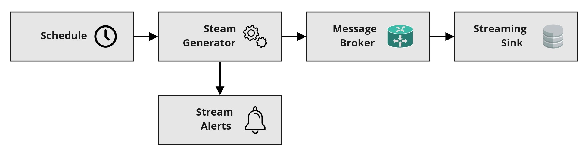

# Data Engineering: Storing Big Data Predict 

## Part-2: Streaming data

Having successfully completed the first task issued by your boss, you've now got everyone's attention and are building confidence with the team. It's now time to move onto the second task where you can establish yourself as a proficient data engineer. 

For this task, your boss recounts a recent project started by the team requiring the set up of a streaming application for a client performing analytics on IoT-based sensor data streams. Seeing potential for future work with this client, as well as an increasing amount of client work that will involve streaming technologies, your boss wants to see your ability to collect and deliver streaming data. Unfortunately, as you aren't currently assigned to the team's project, you won't have access to their streaming data feed. Instead, to complete the streaming pipeline you'll need to set up a mock streaming source of your own. 

### Step 1: Establishing Prerequisites  

Just as was the case in the first task, your boss advises you that there are some prerequisite configuration processes that you'll need to keep in mind in order to develop your streaming data pipeline:

1. **Ensure you have access to an AWS account and IAM role with Admin privileges**: All of the services used during this second task will require some form of policy authorization before being deployed correctly. As such, having access to an IAM role and AWS account which has admin privileges is vital to complete this task. 

2. **Select the correct AWS region**: Your boss reminds you that all work completed needs to take place within the `eu-west-1` AWS region.

3. **Conform to an appropriate naming convention**: Again, as a means to easily see your deployed resources in this task, your boss asks you to use the same naming convention used in task 1. Here, each service resource you configure should be named: **"DE{first 3 letters of your name capitalised}{first 3 letters of your surname capitalised}-{name of service}"**. For example, when configuring a streaming lambda, and having the name *"Dora Explorer"*, the applied service name would be *"DEDOREXP-streaming-lambda"*.   

### Step 2: Drawing an Architectural Diagram

With her confidence increasing in your abilities, your boss mentions that she's going to provide you with more autonomy during this task. This means that you'll have more freedom in choosing how to configure your pipeline. Unfortunately it also means that you'll have to think more carefully around how you will accomplish the task with less guidance. To ensure that you don't get too lost, however, a request is made for you to first draw up an architectural diagram of the system you intend to implement. 

In creating this diagram, you'll need to consider both the type, and the level of detail that will be most appropriate for your task. Always wanting to give a little nudge, your boss requests that you make use of the following AWS services in order to create your application: 

- AWS Kinesis Firehose
- AWS DynamoDB
- AWS S3
- AWS Lambda
- AWS Simple Notification Service
- AWS Cloudwatch Events

In addition to this list, you're also given the following base architecture which you're told should be expanded upon to form your architectural diagram.

<p align='center'>
     
     <br>
     <em>Figure 1:  Baseline architecture diagram offered by your boss.</em>
</p>

Using a combination of the given list, as well as the base diagram, determine the services that will need to be included in your figure. Ensure that you link services together in a logical flow. For example, it may help starting with concepts such as `streaming generator`, `database`, and `alerting service`, and then expanding to specific AWS services thereafter. 

As a final note, your boss mentions how putting effort into this step will help guide your actions in formulating the rest of your pipeline. Eager to learn from her example, you gather your thoughts and start designing. 


|    🚩 **Student Instructions** 🚩    |
| ------------------------------------ |
| Use the provided AWS services list and base architecture diagram to create your own architecture diagram for the streaming pipeline required for this predict task. Follow the guidance provided in this section by choosing the type and level of detail for the diagram.|

|      ⏱ **Assessment Time** ⏱       |
| ------------------------------------ |
|  As part of this task's deliverables, you'll be required to submit your designed architectural diagram to EDSA. As was the case for the YAML templates in the first task, you will receive further instruction on how to submit your diagram file via the regular communication channels. While this diagram won't be directly assessed, the concepts used in its formation will be tested in the end-of-task MCQ that you'll need to complete.|


### Step 3: Setting Up a Streaming Source

Having drawn-up your architecture diagram, you now turn your attention to a fundamental component of the system: the stream source/generator. After thinking about it for a little bit, your boss remembers that she may actually have an old script that can help you out here. This script, provided [here](code/part2/student_streaming_lambda.py), was previously used by her to simulate ticker data being fetched from financial APIs monitoring stock market movements. With a bit of effort, she believes that you can update this script and utilise it as part of your workflow - taking the form of an AWS Lambda function which is triggered at regular intervals to form a stream of ticker data.  

As you study the provided script more carefully, you begin to see how it works. It appears that the script reads from a specified table within the DynamoDB service of AWS, and extracts values associated with five fetched indexes. These index values are randomly updated by a small amount, and are again then written back into the DynamoDB table, ready to repeat the process over again. Based-off your intuition, you realise that the DynamoDB table must have had the following item structure:

```json
Item_1 :[
    {key: "TickerName", value: "Index_1"},
    {key: "Price", value: 100}
],

Item_2 :[
    {key: "TickerName", value: "Index_2"},
    {key: "Price", value: 90}
],

Item_3 :[
    {key: "TickerName", value: "Index_3"},
    {key: "Price", value: 80}
],

Item_4 :[
    {key: "TickerName", value: "Index_4"},
    {key: "Price", value: 70}
],

Item_5 :[
    {key: "TickerName", value: "Index_5"},
    {key: "Price", value: 60}
]    
```

For each item above, the `TickerName` field caries the name of the index that is extracted by the script, and the `Price` field carries the initial value of each index that is incrementally updated during each iteration of the script.

Armed with this knowledge, you realise that in order to get the script to work as part of your data pipeline you need to perform the following actions: 
  
  1. **Create a DynamoDB table** that contains the items indicated above. As motivated by your boss, this table should be named using your task naming convention ending with `-streaming-dynamodb` (e.g. `DEDOREXP-streaming-dynamodb`). 
  
  2. **Configure the script as an AWS Lambda**. This action will require filling out some missing code in the script which references the DynamoDB table that you've created, as well as fixing the `get_current_time()` function which appears to be missing some of its contents. Again, your boss asks that you use your task naming convention, ending with `streaming-lambda` (e.g. `DEDOREXP-streaming-lambda`). 

  3. **Create an IAM Policy and Role** which allows the created lambda to run successfully. 

Once you've performed these actions, you should be able to run your lambda manually and see the initial values you've entered into the DynamoDB table automatically update. 


|    🚩 **Student Instructions** 🚩    |
| ------------------------------------ |
| Complete actions 1-3 as outlined above, taking especial note of the naming convention required if specified. You should be able to see the values of the DynamoDB table update before moving on to the next step within the task.| 


### Step 4: Configuring a Lambda Trigger

It feels great to have your lambda function run and generate new data that can simulate a data stream. Unfortunately, executing this script manually on a continual basis just isn't practical. For this reason, you realise that you need to configure a trigger for lambda which will run it on a periodic basis. 

Your boss approves of this idea, suggesting that you use the AWS CloudWatch service to configure your trigger. Furthermore, as this is just a prototype project, you're asked to *only invoke the lambda function every 60 seconds* in order to reduce costs.


|    🚩 **Student Instructions** 🚩    |
| ------------------------------------ |
| As indicated above, you'll now need to configure a CloudWatch-based trigger that will run your lambda data generation function every 60 seconds.                      |


### Step 5: Add Alerts for Lambda Failures

One of the central principles in data engineering is observability. Citing this, your boss indicates that you'll need to equip your growing pipeline with some monitoring functionality. As a first step, she suggests that you create an AWS SNS notification that sends a custom email to one or more email addresses whenever the configured lambda-based script stops functioning correctly. 

After considering how you'll do this for a little while, you come up with a solution: you'll create a second lambda script that will be called by your streaming lambda function if it ever fails to run fully. Putting this plan into action, you create [this](code/part2/lambda_sns_notification.py) short python script that can call the SNS service to send your custom message to a given topic when invoked. This topic can then be configured to send an email to any confirmed email addresses when it receives a message. 

To put this notification solution in place, you determine that you'll need to complete the following actions:

  1. **Set up an SNS topic with an email endpoint**. This topic will cause emails to be generated whenever it receives a message from a source service (such as the notification generated by your notification lambda function). You decide to follow your previous naming convention, calling the SNS topic with "-streaming-sns-topic" appended (e.g. *"DEDOREXP-streaming-sns-topic"*).

  2. **Complete the short SNS notification script and convert it into a lambda function**. The completion step requires that you both specify the AWS ARN of the SNS topic you create, as well as giving your full name (so that your boss can easily identify that its your pipeline that fails...). Once completed you'll need to set this script up as an AWS lambda function, along with a relevant IAM policy and role that will enable its execution. For ease of identification, your boss asks that you name this lambda function with the task naming convention, followed by *-notification-lambda* (e.g. *"DEDOREXP-notification-lambda"*)

  3. **Configure your streaming lambda to trigger the notification lambda upon failure**. This triggering process should be possible via the AWS Lambda Dashboard, and can be configured to occur in an asynchronous manner.       

|    🚩 **Student Instructions** 🚩    |
| ------------------------------------ |
| As before, complete actions 1-3 in order to finish this step. Importantly, you'll need to ensure that you register the `edsa.predicts@explore-ai.net` email address as an email recipient, along with your personal email address, when configuring the SNS topic as part of action 1. |

### Step 6: Connect AWS Kinesis Firehose to Streaming Service

With your notification lambda set up, you now have only one major component of your streaming pipeline to configure - the streaming application itself! The role of this application is to receive data streamed from a source, and to transfer this in a reliant manner to a down-stream storage destination. 

Luckily for you, this component seems quite easy to configure, as AWS Kinesis offers a simple solution to receive a stream of data and to place this into S3-based object storage. Your boss seems very happy with this streaming solution. In addition, she requests that you provide public access to the destination S3 bucket you configure in order to allow her to provide live demos to current and future clients.

To make these final changes, you believe the following actions are necessary: 

  1. **Create an AWS Kinesis Firehose delivery stream with an S3 bucket end-point**. To make your destination bucket easy to find, you're asked to name it following the task naming convention, using your full name to ensure global uniqueness, followed by *"-deliverystream-s3"* (ex. *"dedoraexplorer-deliverystream-s3"*). For the delivery stream you create, you can are also asked to follow the standard task naming convention, followed by *'-deliverystream'*, e.g. *'dedorexp-deliverystream'*.

  2. **Update the destination bucket permissions to make it publicly accessible**. This update of privacy settings should allow any authenticated AWS account to have full read (NOT write) privileges for your bucket. 

  3. **Update the streaming lambda function to place the generated data into the configured delivery stream**. Examining your streaming lambda script again, you notice that you only need to insert a couple lines of code to enable it to write its generated ticker data into your Kinesis delivery stream. 

With these actions outlined, you set off to build out the last components of your streaming application. You feel that the end is in sight.

|    🚩 **Student Instructions** 🚩    |
| ------------------------------------ |
|  Complete actions 1-3 given above, ensuring that you follow the naming conventions prescribed. At the conclusion of these actions, you should have a fully functioning streaming application.|

|      ⏱ **Assessment Time** ⏱       |
| ------------------------------------ |
|  It's vital that you follow the prompt in action 2 to *make your destination S3 bucket publicly accessible*. We will use automated means to read your bucket, and to assign assessment marks based on its discovered content. |

### Step 7: Test your Streaming Pipeline

It's finally done! With a last couple of keystrokes, you deploy the updates made to your streaming lambda - enabling it to push data through to Kinesis Firehose and subsequently your S3 bucket. You eagerly navigate to your S3 bucket and inspect its contents. As expected, you now have a growing collection of ticker data which grows every minute as the streaming lambda is triggered. 

Seeing this, your boss walks over to give you a big high-five. You've done a fantastic job and have really impressed her and the team. However, as a final lesson for the day, your boss mentions that it's just as important to ensure that the monitoring functionality works, protecting you from being blind-sided if the system fails. To do this test, she suggests that you break your streaming lambda function by commenting out a large portion of code. After waiting for a short while, you should then start seeing email notifications within your inbox, indicating that the streaming application has failed.

|    🚩 **Student Instructions** 🚩    |
| ------------------------------------ |
|  In this step you should gain the satisfaction of testing your application to see if it functions correctly. If the previous steps were executed accurately, you should see new content being loaded into your S3 destination bucket every minute. Furthermore, when breaking your streaming lambda code as suggested above, you should start receiving SNS-based alert emails after a couple of minutes indicating that your pipeline has failed. If you see these messages, as well as the incrementing content in your S3 bucket, then your pipeline is functioning correctly - well done! |

|      ⏱ **Assessment Time** ⏱       |
| ------------------------------------ |
|  In a similar manner to your S3 bucket contents, we will be using automated means to assess your generated SNS emails which indicate your pipeline's failure. As such please *ensure that the `edsa.predicts@explore-ai.net` address is a confirmed recipient of your SNS-based email notifications* generated by your system.|

|      ⏱ **Assessment Time** ⏱       |
| ------------------------------------ |
|  With this final step completed, you are now ready to undertake the Part-2 MCQ of the predict. This MCQ will assess multiple concepts that have been covered in the above steps, and as such focus should be placed on understanding the processes which have been followed, and not only their outcomes. |

### Step 8: Environment Teardown

With the second task being a tremendous success again, your boss and the team unanimously agree that they're taking you out to dinner! Before you leave the office, however, you need to delete the resources you've set up. This, after all, is another great habit to form as a data engineer. 

|    🚩 **Student Instructions** 🚩    |
| ------------------------------------ |
|  Once you've ensured that your pipeline is working (based on the observations in the previous step), proceed by deleting all of the resources you've configured for task 2 **except your S3 bucket**. Once the automated assessment of this resource has been completed, we'll let you know so that you can safely release this resource as well. |


|    💸 **Infrastructure Cost** 💸    |
| ------------------------------------|
|  Even though the majority of resources set up within this portion of the predict are in the AWS free tier, it's vital that you shut them down carefully. Missing this step can mean that long-running resources exceed their free-tier quota, and result in unforeseen account charges being incurred! |